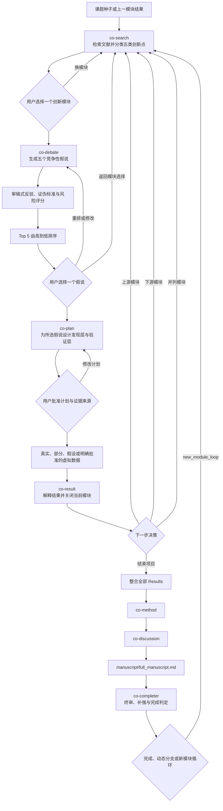

# Co-Paper Skills

一套按“模块—假说—计划—结果”递进的生物医学论文协作技能。

`co-paper` 是总控。它不会一次性生成完整课题，也不会在检索后替用户直接选定机制。每一轮包含两次明确的人类决策：先选择创新模块，再从 `co-debate` 排序后的五个假说中选择一个进入计划。

## 整体流程



核心主链：

```text
co-search
-> 用户选择创新模块
-> co-debate 生成并排序 Top 5 假说
-> 用户选择一个假说
-> co-plan
-> co-result
```

项目结束后：

```text
final co-result -> co-method -> co-discussion
-> full_manuscript.md -> co-completer
```

## 技能职责边界

职责边界如下：

| Skill | 只负责什么 | 必须停在哪里 |
|---|---|---|
| `co-search` | 检索文献、提取创新点、分类模块 | 用户选择一个模块 |
| `co-debate` | 围绕所选模块提出、反驳并排序五个竞争假说 | 用户选择一个假说 |
| `co-plan` | 为所选假说设计可执行分析、发现层、验证层和 rescue | 用户批准计划 |
| `co-result` | 按声明的来源模式解释结果、写模块 Results | 用户决定下一模块或结束 |
| `co-method` | 从稳定 Results 反推 Methods | Methods 完成 |
| `co-discussion` | 写 Introduction、Discussion 和编号文献 | 全文组装 |
| `co-completer` | 终审、补强、完成或动态恢复 | 用户选择最终路线 |

这种拆分避免三个问题：检索阶段偷选机制、规划阶段缺少竞争假说、最终论文隐藏被否定的替代解释。

## co-debate Top 5 规则

- 必须生成五个真正竞争的假说，不能只是同一通路的五种写法。
- 关联性证据下至少包含一个零假说、混杂解释或反向因果解释。
- 每个假说包含支持证据、最强反驳、替代解释、决定性检验和证伪标准。
- 按新颖性、证据强度、可行性、因果可检验性和转化价值加分；按撞题风险和总体风险扣分。
- 从高到低输出 Top 5，然后必须等待用户选择。
- `co-plan` 只能接收用户选择的一个假说。

## 模块证据结构

每个模块保留两层证据：

1. 节点发现层：通过单细胞、bulk、多组学、公共数据、筛选或高通量实验找到新表型、分子或机制节点。
2. 验证层：干预上游或输入端并观察下游或输出端；若声称中介作用，需要 rescue，或明确标记缺失。

网络推断、regulon、配体—受体、通路富集和虚拟敲除默认只用于生成假说，不能单独作为因果证明。

## 状态文件

`co-paper` 项目至少保存：

- `project_state.md`
- `decision_log.md`
- `module_ledger.csv`
- `hypothesis_ledger.csv`
- `evidence_ledger.csv`
- `source_mode_ledger.csv`

`hypothesis_ledger.csv` 保存每轮五个假说的评分、排名和用户选择，使被放弃的替代解释仍可追踪。

## Skill 目录

```text
co-paper/       总控、状态和全文装配
co-search/      文献创新模块检索
co-debate/      Top 5 假说辩论与排序
co-plan/        单一所选假说的执行计划
co-result/      模块结果、图版和来源账本
co-method/      Methods
co-discussion/  Introduction、Discussion 和文献
co-completer/   终审、补强和动态恢复
```

## 触发示例

```text
Use $co-paper

围绕类风湿关节炎滑膜成纤维细胞代谢开展模块化研究。
先用 co-search 给出五类创新模块，让我选择一个；
再用 co-debate 生成、反驳并从高到低排序五个假说，让我选择一个；
只有选定假说后才进入 co-plan。
```

单独调用辩论阶段：

```text
Use $co-debate

Selected module: <来自 co-search 的模块>
请生成五个竞争性假说，逐一反驳并排序，等待我选择后再交给 co-plan。
```

## 安装与校验

将需要的目录复制到 Codex skills 目录，例如：

```text
~/.codex/skills/co-paper
~/.codex/skills/co-search
~/.codex/skills/co-debate
~/.codex/skills/co-plan
~/.codex/skills/co-result
~/.codex/skills/co-method
~/.codex/skills/co-discussion
~/.codex/skills/co-completer
```

使用 `skill-creator/scripts/quick_validate.py <skill-folder>` 校验每个 skill。使用 `co-paper/scripts/scaffold_project.py` 创建项目状态目录，使用 `co-debate/scripts/scaffold_debate.py` 创建五假说辩论模板。
