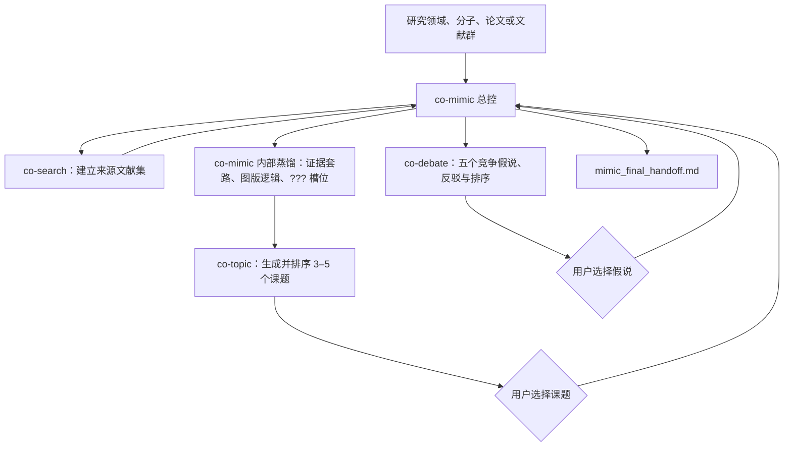
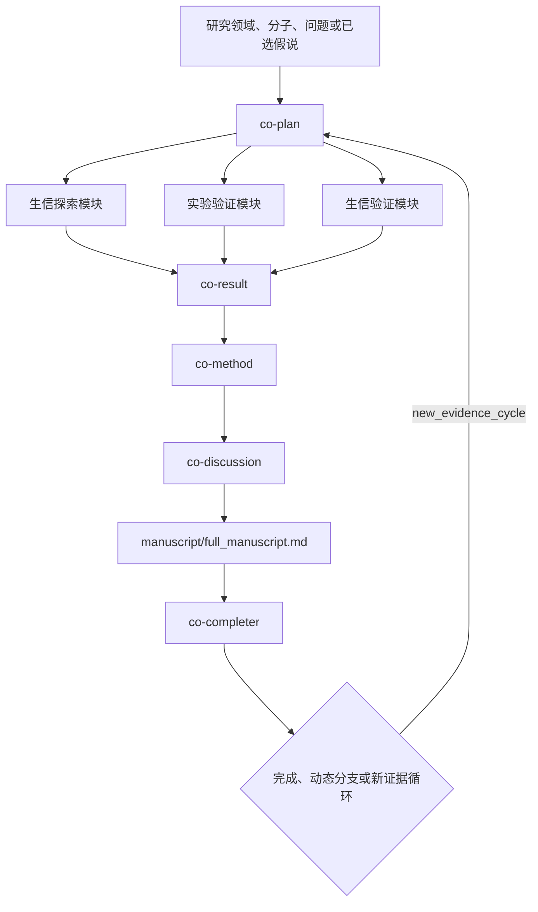

# Co-Paper Skills

一套由两个独立总控组成的生物医学选题与论文协作技能集：

- `co-mimic`：仿生选题总控，管理文献检索、套路蒸馏、课题生成和假说辩论。
- `co-paper`：论文执行总控，从研究领域、疾病、分子、表型或已选假说直接进入三模块证据计划，并完成全文。

## 总体架构

### 1. Co-Mimic 选题体系

`co-mimic` 是父级总控，用户只需启动它。`co-search`、`co-topic` 和 `co-debate` 是由它管理的子技能。



关键规则：

- `co-search` 完成后必须把控制权交还 `co-mimic`，不能直接调用 `co-topic`。
- `co-topic` 返回课题卡和用户选择，由 `co-mimic` 决定何时调用 `co-debate`。
- `co-debate` 返回最终假说，由 `co-mimic` 决定停止，或经用户同意交给 `co-paper`/`co-plan`。
- 模仿的是证据结构，不复制来源论文的靶点、文字或完整生物学故事。
- 未发现的新分子或节点保持为 `???`，直到真实发现流程给出候选。

### 2. Co-Paper 论文执行体系

`co-paper` 不再把 `co-search` 放在最前面。它直接接收用户提出的研究领域、疾病、表型、干预、分子，或 `co-mimic` 最终选出的假说。



完整主链：

```text
research field / disease / molecule / phenotype / selected hypothesis
-> co-plan
   -> bioinformatics exploration
   -> experimental validation
   -> independent bioinformatics validation
-> co-result
-> co-method
-> co-discussion
-> manuscript/full_manuscript.md
-> co-completer
```

## 三模块证据结构

1. **生信探索模块**：通过公共数据、用户数据、组学、网络或筛选发现并优先排序候选分子、通路、表型、细胞状态或机制轴。
2. **实验验证模块**：通过干预、表型与分子读出、直接结合/机制实验和必要的 rescue 检验功能与因果关系。
3. **生信验证模块**：使用独立队列、留出样本、正交数据类型或真正正交的计算分析，检验复现性、稳健性、特异性和临床相关性。

探索与生信验证不能把同一数据集、同一对比和同一特征筛选冒充独立证据；只能诚实标记为内部稳健性分析。

## 技能职责

| Skill | 职责 |
|---|---|
| `co-mimic` | 选题总控；管理 co-search、内部套路蒸馏、co-topic、co-debate 和最终交接 |
| `co-search` | 在 co-mimic 管理下建立文献矩阵、证据账本、方法清单和排除图谱 |
| `co-topic` | 从蒸馏套路生成、批判并排序 3–5 个课题，返回 co-mimic |
| `co-debate` | 围绕选中课题生成、反驳并排序五个竞争假说，返回 co-mimic |
| `co-paper` | 论文执行总控和全文组装 |
| `co-plan` | 同时规划生信探索、实验验证和独立生信验证 |
| `co-result` | 整合三模块 Results，并生成 Methods/Discussion 交接 |
| `co-method` | 从稳定 Results 生成可复现 Methods 和结果—方法映射 |
| `co-discussion` | 写 Introduction、Discussion、编号参考文献和全文交接 |
| `co-completer` | 终审、返修、完成判定、动态分支或新证据循环 |

## 关键交接文件

```text
co-result:
  methods_input.md
  discussion_input.md
  downstream_handoff.md

co-method:
  manuscript/methods.md
  manuscript/result_to_method_map.csv
  manuscript/co_discussion_handoff.md

co-discussion:
  manuscript/introduction.md
  manuscript/discussion.md
  manuscript/references_numbered.md
  manuscript/full_manuscript_handoff.md
```

## Co-Completer 出口

- `complete_project`：保存完成记录。
- `dynamic_branch`：从既有计划、结果、图版、方法或全文节点建立分支，不覆盖原稿。
- `new_evidence_cycle`：回到 `co-plan -> co-result -> co-method -> co-discussion`。
- 如果用户想换课题或重新生成假说，离开 Co-Paper，单独启动 `co-mimic`。

## 安装

将所需技能目录复制到 Codex skills 目录：

```text
~/.codex/skills/co-mimic
~/.codex/skills/co-search
~/.codex/skills/co-topic
~/.codex/skills/co-debate
~/.codex/skills/co-paper
~/.codex/skills/co-plan
~/.codex/skills/co-result
~/.codex/skills/co-method
~/.codex/skills/co-discussion
~/.codex/skills/co-completer
```

## 使用示例

选题：

```text
Use $co-mimic

研究领域：骨关节炎滑膜成纤维细胞
目标：检索代表性论文，蒸馏证据套路，生成 3–5 个不复制已知靶点的课题，
再对我选中的课题生成并排序五个竞争假说。
```

论文执行：

```text
Use $co-paper

研究分子：<molecule>
疾病背景：<disease>
请直接调用 co-plan，同时设计生信探索、实验验证和独立生信验证，
随后依次完成 co-result、co-method、co-discussion、全文组装和 co-completer。
```
